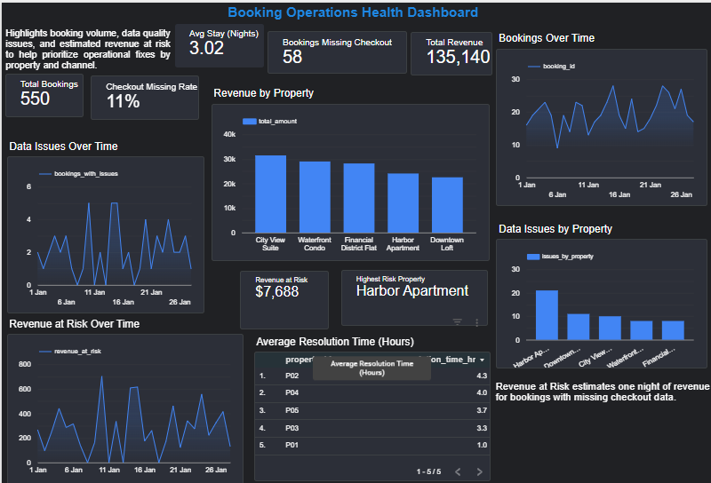

# Booking Operations Health Dashboard

## Project Overview
This project analyzes booking performance and operational health across multiple properties using Looker Studio.  
The objective is to identify operational inefficiencies, monitor data quality issues, and estimate potential revenue leakage caused by missing checkout data.

The dashboard provides centralized visibility into booking trends, issue resolution metrics, and revenue performance.

---

## Business Problem

Operations teams lacked clear visibility into:

- Bookings with missing checkout data
- Revenue at risk due to incomplete records
- Property-level operational performance
- Issue resolution time trends
- Revenue contribution by property

Without structured monitoring, revenue leakage and data inconsistencies could go unnoticed.

This dashboard addresses that gap.

---

## Tools Used

- Looker Studio (Dashboard Development)
- SQL (Metric Logic & Validation)
- CSV Data Sources
- GitHub (Project Documentation)

---

## Data Sources

The project uses three datasets:

### 1. bookings.csv
Contains booking-level information:
- booking_id
- property_id
- checkin_date
- checkout_date
- total_amount

### 2. ops_issues.csv
Contains operational issue details:
- booking_id
- issue_flag
- resolution_time_hours

### 3. properties.csv
Contains property metadata:
- property_id
- property_name
- city

---

## Data Model

- `bookings` is the primary fact table.
- `properties` is joined to bookings using `property_id` (1:M relationship).
- `ops_issues` is joined to bookings using `booking_id` (1:M relationship).

LEFT JOIN logic is used to avoid unintentionally dropping bookings during analysis.

---

## Key KPIs

The dashboard tracks:

- Total Bookings
- Checkout Missing Rate (%)
- Total Revenue
- Revenue at Risk
- Average Stay (Nights)
- Revenue by Property
- Data Issues Over Time
- Average Resolution Time (Hours)

---

## Calculated Metrics Logic

### Revenue at Risk
Revenue at risk estimates one night of revenue for bookings with missing checkout data.

Logic:
- If checkout_date is NULL,
- Estimate one-night revenue using total_amount divided by number of nights,
- Sum across all affected bookings.

---

## SQL Logic Used for Data Validation

The following SQL queries replicate dashboard KPIs:

### 1. Total Bookings
SELECT COUNT(*) AS total_bookings
FROM bookings;

### 2. Checkout Missing Rate
SELECT 
    COUNT(CASE WHEN checkout_date IS NULL THEN booking_id END) * 100.0 
    / COUNT(*) AS checkout_missing_rate
FROM bookings;

### 3. Average Stay (Nights)
SELECT 
    AVG(DATEDIFF(day, checkin_date, checkout_date)) AS avg_stay_nights
FROM bookings
WHERE checkout_date IS NOT NULL;

### 4. Revenue by Property
SELECT 
    p.property_name,
    SUM(b.total_amount) AS total_revenue
FROM bookings b
LEFT JOIN properties p 
    ON b.property_id = p.property_id
GROUP BY p.property_name
ORDER BY total_revenue DESC;

### 5. Revenue at Risk
SELECT 
    SUM(
        CASE 
            WHEN checkout_date IS NULL 
            THEN total_amount / NULLIF(DATEDIFF(day, checkin_date, CURRENT_DATE), 0)
            ELSE 0 
        END
    ) AS revenue_at_risk
FROM bookings;

### 6. Average Resolution Time (Hours)
SELECT 
    AVG(resolution_time_hours) AS avg_resolution_time
FROM ops_issues;

---

## Key Insights

- Approximately 11% of bookings contain missing checkout data.
- Revenue at risk fluctuates mid-month, indicating operational inconsistencies.
- Harbor Apartment shows the highest operational exposure.
- Resolution time varies significantly across properties, indicating uneven process efficiency.
- A small percentage of incomplete records can materially impact revenue visibility.

---
## Live Dashboard

https://lookerstudio.google.com/u/0/reporting/9c478626-3973-4aee-bc2a-1dc5ecd0b931/page/MuZmF

## Dashboard Preview

Example:

---

## Conclusion

This project demonstrates:

- KPI design and metric logic development
- Data modeling and relationship management
- Revenue risk estimation methodology
- Business-focused dashboard storytelling
- SQL validation of BI metrics

The dashboard supports operational teams in identifying data quality gaps and mitigating revenue leakage proactively.
